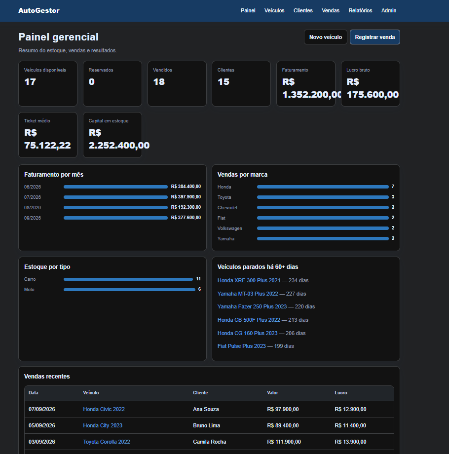
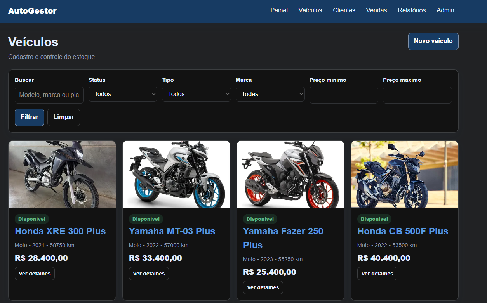
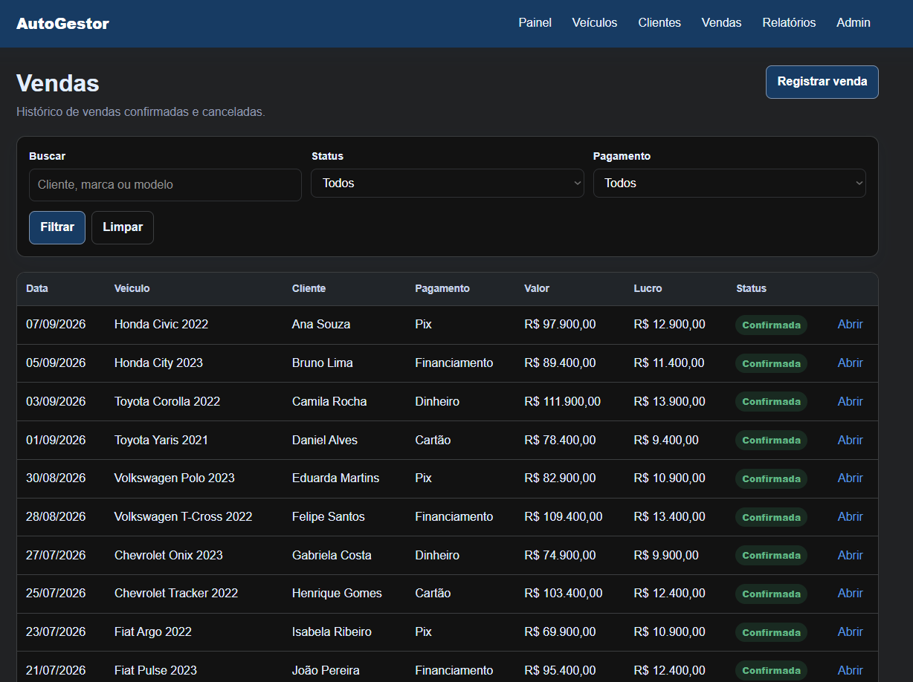
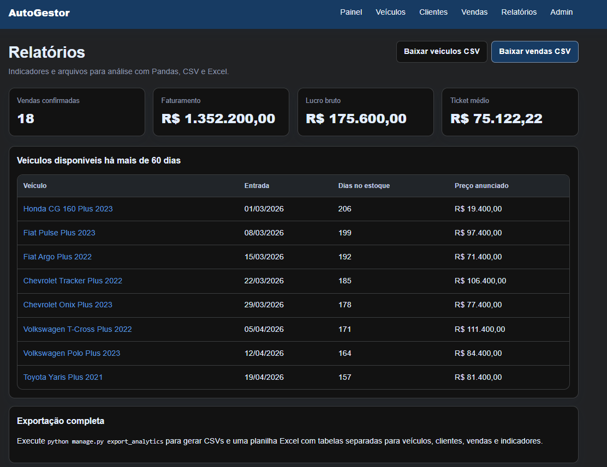

# AutoGestor — gestão de veículos e vendas

Sistema de gestão de veículos, clientes, estoque, vendas e indicadores desenvolvido com Django e SQL.

## O que já está pronto

- cadastro, edição, consulta, filtros e exclusão de veículos;
- upload de várias imagens e escolha da imagem de capa;
- cadastro e histórico de clientes;
- registro e cancelamento de vendas;
- alteração automática do status do veículo;
- bloqueio de duas vendas confirmadas para o mesmo veículo;
- cálculo de faturamento, lucro bruto, ticket médio e capital em estoque;
- painel responsivo sem depender de bibliotecas JavaScript externas;
- relatórios em CSV;
- exportação para CSV e Excel, com análise usando Pandas;
- dados fictícios de demonstração;
- consultas SQL comentadas;
- testes automatizados.

## Instalação no Windows

O projeto requer Python 3.12 ou mais recente.

### Opção mais simples

`INICIAR_WINDOWS.bat`. Na primeira vez, o arquivo cria a pasta `venv`, instala as dependências, 
confere o banco e abre o sistema no navegador.


## Gerar os arquivos de análise

```powershell
py manage.py export_analytics
py analytics\analise_vendas.py
```

Os arquivos serão gravados em `data_exports/`:

- `vehicles.csv`;
- `customers.csv`;
- `sales.csv`;
- `sales_analysis.csv`;
- `summary.csv`;
- `autogestor_analise.xlsx`;
- análises agrupadas por mês e marca.

## Executar os testes

```powershell
py manage.py test
```

Os testes verificam as principais regras: venda altera estoque, cancelamento
devolve o veículo, venda duplicada é rejeitada, datas inválidas são bloqueadas,
telas carregam e exportações respondem corretamente.

## Regras de negócio principais

1. Um veículo começa como `Disponível` ou pode ser marcado como `Reservado`.
2. Uma venda confirmada muda o veículo para `Vendido`.
3. Uma venda cancelada muda o veículo para `Disponível`.
4. Só pode existir uma venda confirmada por veículo.
5. A data da venda não pode ser anterior à entrada no estoque.


## Demonstração:

## Painel Geral


## Gestão de veículos


## Registro de vendas


## Relatórios

